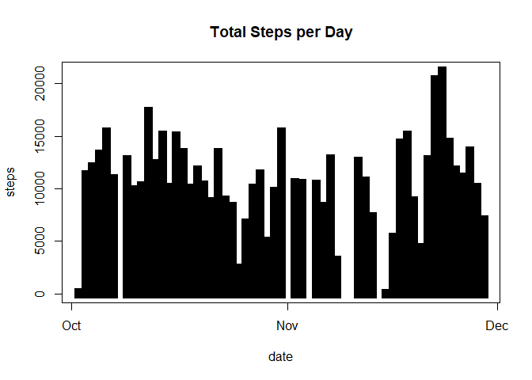
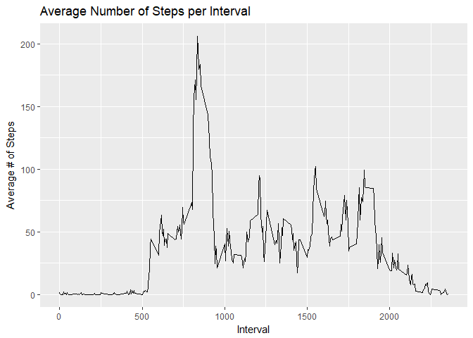
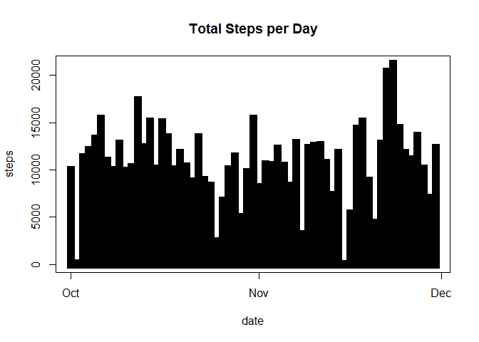
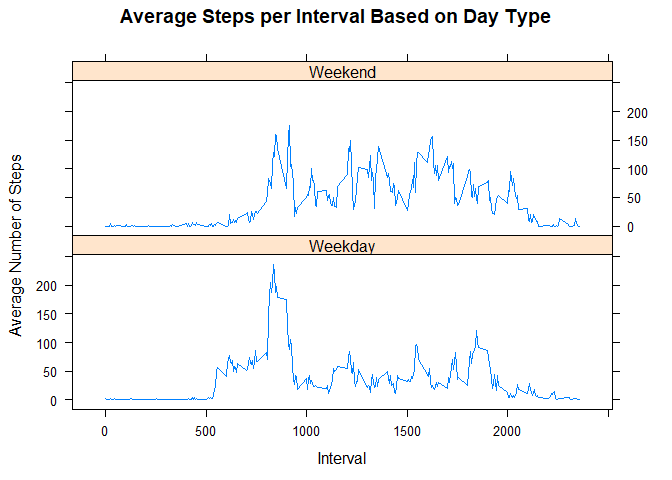

```r
# get libraries
libpath <- .libPaths()
filepath <- "C:/Users/flare/OneDrive/Documents/R projects/coursera/projects/rdsp1"
setwd(libpath)
library(plyr)
library(ggplot2)
library(lattice)
setwd(filepath)
```

## Loading and preprocessing the data  

```r
setwd(filepath)
active <- read.csv("activity.csv")
active$datetime <- as.POSIXct(active$date, format = "%Y-%m-%d")
active$day <- weekdays(as.Date(active$date))
activeClean <- active[!is.na(active$steps),]
```

## What is mean total number of steps taken per day?  

```r
# get total steps per day
sumSteps <- aggregate(active$steps ~ active$datetime, FUN=sum)
colnames(sumSteps)<- c("date", "steps")

# make histogram of total steps per day
plot(sumSteps, type = "h", lwd=11, lend="square", main="Total Steps per Day")
```

<!-- -->

```r
# get and report mean / median total steps per day
meanSteps <- as.integer(mean(sumSteps$steps))
medianSteps <- as.integer(median(sumSteps$steps))
meanSteps
```

```
## [1] 10766
```

```r
medianSteps
```

```
## [1] 10765
```

Mean total steps taken per day: 10766.   
Median total steps taken per day: 10765.

## What is the average daily activity pattern?  


```r
# make time-series plot
timeSeries <- ddply(activeClean, .(interval), summarize, avgint = mean(steps))
g <- ggplot(timeSeries, aes(x=interval, y=avgint), xlab = "Interval", ylab="Average # of Steps")
g + geom_line()+xlab("Interval")+ylab("Average # of Steps")+ggtitle("Average Number of Steps per Interval")
```

<!-- -->

```r
# get interval with max average steps
maxInt <- max(timeSeries$avgint)
as.integer(maxInt)
```

```
## [1] 206
```

```r
maxInterval <- timeSeries[timeSeries$avgint==maxInt,1]
maxInterval
```

```
## [1] 835
```

The 5min interval with the most steps in it was the 835 interval.
It had 206 steps in it.

## Imputing missing values

```r
nrow(active[is.na(active$steps),])
```

```
## [1] 2304
```

There are 2304 rows with step data as NA.

To replace these NA values, I will use the mean of each interval sorted by weekday.


```r
# get mean steps taken per interval and weekday
meanTable <- ddply(activeClean, .(interval, day), summarize, avgsteps = mean(steps))

# substitute for NA values and merge with NA data
naData<- active[is.na(active$steps),]
naMerged <-merge(naData, meanTable, by=c("interval", "day"))

# reorder columns to line up with original clean data
naMerged2<- naMerged[,c(6,4,1,2,5)]
colnames(naMerged2)<- c("steps", "date", "interval", "day", "datetime")

# merge clean data with NA-substituted averages
activeMerge <- rbind(activeClean, naMerged2)
```

With the merged data set created I can now plot a new histogram.


```r
# get total steps per day
sumSteps2 <- aggregate(activeMerge$steps ~ activeMerge$datetime, FUN=sum)
colnames(sumSteps2)<- c("date", "steps")

# make histogram of total steps per day
plot(sumSteps2, type = "h", lwd=11, lend="square", main="Total Steps per Day")
```

<!-- -->

```r
# get and report mean / median total steps per day
meanSteps2 <- as.integer(mean(sumSteps2$steps))
medianSteps2 <- as.integer(median(sumSteps2$steps))
meanSteps2
```

```
## [1] 10821
```

```r
medianSteps2
```

```
## [1] 11015
```

Mean total steps taken per day: 10821. This mean differs from the original mean calculated by 55 steps.   
Median total steps taken per day: 11015. This median differs from the original median calculated by 250 steps.


## Are there differences in activity patterns between weekdays and weekends?


```r
# make new column for type of day during the week
activeMerge$daytype <- ifelse(activeMerge$day %in% c("Saturday", "Sunday"), "Weekend", "Weekday")

# time series by interval and type of day
timeSeries2 <- ddply(activeMerge, .(interval, daytype), summarize, avgsteps = mean(steps))

# make panel plot comparing the two
xyplot(avgsteps~interval|daytype, data=timeSeries2, type="l",  layout = c(1,2),
       main="Average Steps per Interval Based on Day Type", 
       ylab="Average Number of Steps", xlab="Interval")
```

<!-- -->

These plots show that there are indeed differences in activity patterns between weekends and weekdays, which may have  
to do with the added availability people have to exercise on weekends.
